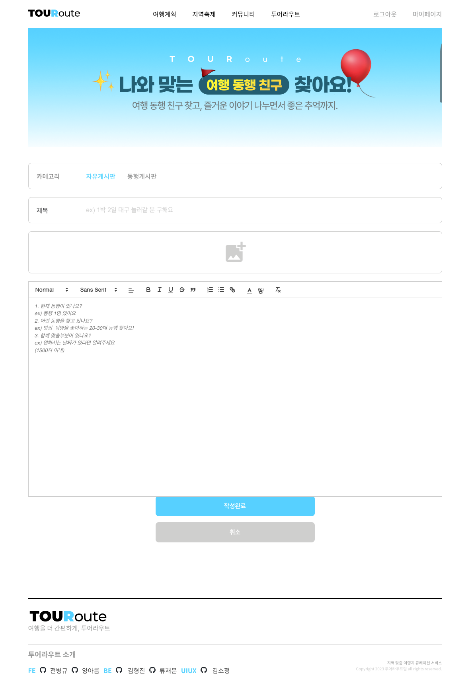
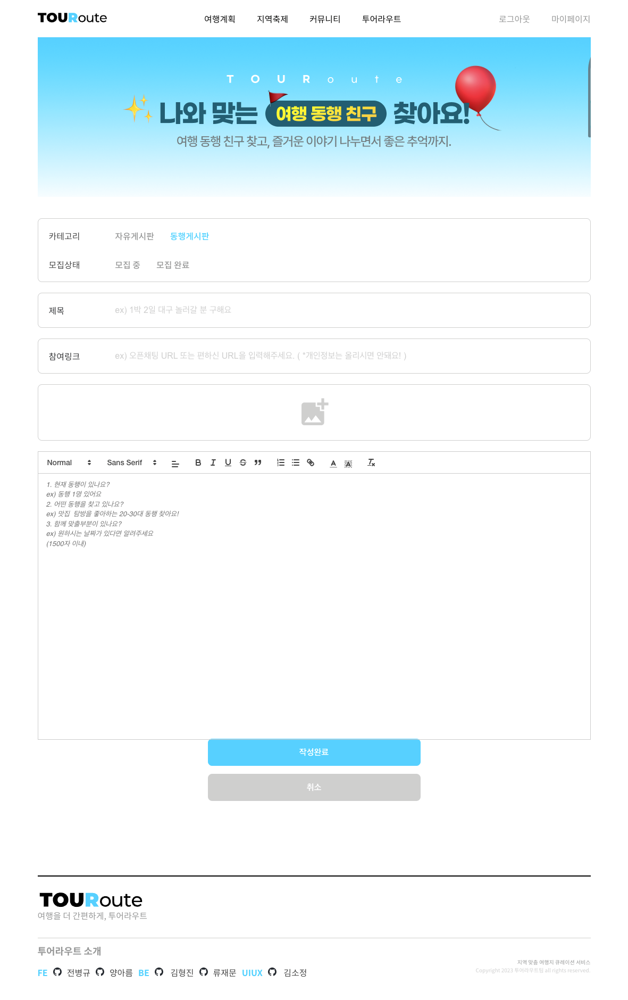
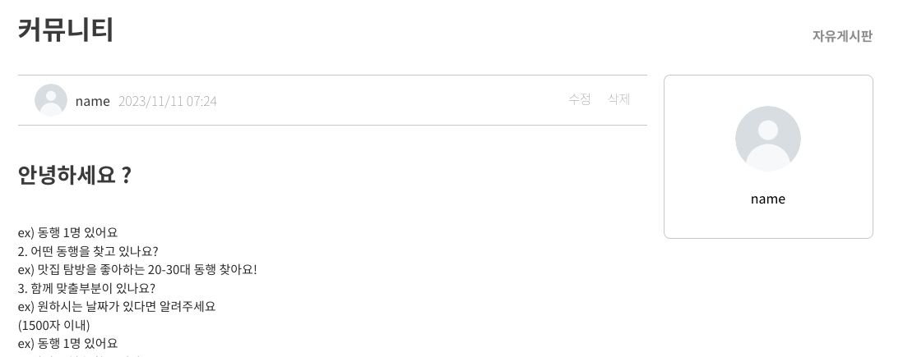
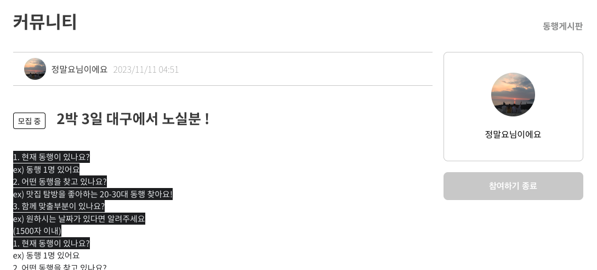
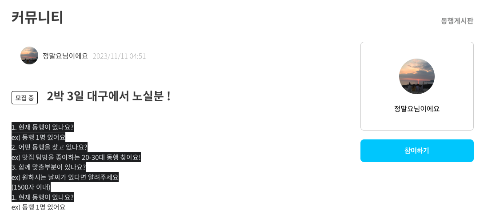
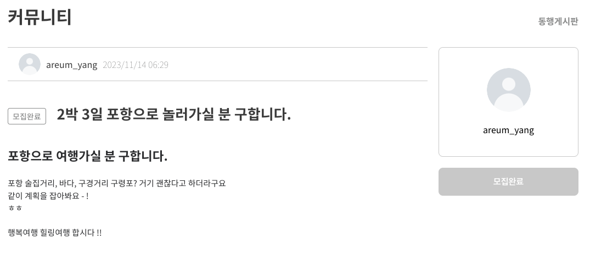

# 🪄 간편 여행의 시작, [ 투어라우트 ]

 
<h2 style="line-height: 1.7">경상도 지역의 여행지를 추천받고, 커뮤니티에서 동행인도 만날 수 있는 간편한 여행의 시작. 투어라우트</h2>

계획을 짜서 여행하고 싶은 사람들 ! 하지만, 여행을 계획하는 것을 어려워하고 귀찮아하는 사람들은 보라 ! 여행계획을 대신 짜주는 투어라우터를 이용해보세요 ! 😊

 

## 📢 프로젝트 소개

 

### 💻 개발 프로세스

- **개발 기간**  
  2023.08.01 ~ 2023.11.06

- **배포**  
  2023.11.07

- **개발환경**  

  - 협업 툴  
    
    
    

  - **개발 환경 및 배포**  
    
    
    
    
    
    
    

  - **FE 사용기술**  
    
    
    
    
    
    

  - **BE 사용기술**  
    
    
    
    
    
    

 

## ✨ 투어라우트 팀원! ✨

 

## 📖 프로젝트 설명

### 🤔 주제 선정을 위한 브레인스토밍

- **초안**
  1. 👉🏻 우리가 할 수 있는 것이 무엇일까 ?
  2. 👉🏻 여행에 관심이 있다 ?
  3. 👉🏻 여행에 관련된 정보들을 어떻게 알 수 있을까 ?
  4. 👉🏻 여행 계획을 설계해주는 애플리케이션을 만들자 !
- **종합**
  - 👉🏻 여행에 관심을 가지고 여행에 대한 정보들을 파악하기 위해 다양한 사이트를 통해 수집해야 하는데, 처음 접하는 사람들은 수집에 한계가 있기에 이런 사람들을 위해 서비스를 제공하고자 여행 계획을 대신 작성해주는 애플리케이션을 구현하였다.

### 🤔 목적 및 필요성

- 국내 관광객을 대상으로 맞춤형 여행 계획 서비스를 제작함으로 여행객들에게 여행 일정에 관련된 편의를 도모한다.
- 여행객에게 필요한 맞춤형 여행 스타일 서비스와 최적의 동선으로 일정을 정리해 주는 간편함을 제공한다.
- 사용자로 하여금 여행에 있어서 불편함을 덜어내고 편리함을 주는 목적으로 한다. 계획 수립, 동선 파악, 여행의 스타일 등 기존에 있는 웹애플리케이션들의 문제점을 개선하여 사용자에게 도움이 되고 부담 없이 언제든 여행할 수 있다.

 

### ✨ 주요기능

- **여행계획**

  - 목적 : 국내 관광객을 대상으로 맞춤형 여행 계획 서비스를 제작함으로써 여행객들에게 여행 일정에 관련된 편의를 도모한다.
  - 특징 : 사용자로 하여금 여행에 있어서 여행 계획을 입력하여 여행 일정 동선 파악, 여행의 스타일 등 사용자에게 일정들을 소개 해준다.

   

- **축제**

  - 목적 : 국내 잘알려지지 않는 다양한 축제를 사용자에게 안내해준다.
  - 특징 : 경상도 개최하는 다양한 축제의 상세내용까지 안내준다.

   

- **커뮤니티**

  - 목적 : 자유게시판에서 궁금한 질문들을 물어보고, 동행게시판에서 여행을 같이하고 싶은 동행자를 찾는 공간을 마련했다.
  - 특징 : 게시판을 카테고리별로 구분 지어 사용자가 보기에 편리한 구조를 제공했다.

   

- **동행서비스**

  - 목적 : 새로운 여행 파트너를 구할 수 있도록 안내 해준다.
  - 특징 : 동행이메일을 입력하여 여행 계획일정들을 공유 해준다.

    

👨‍💻 **[Front-End Github](https://github.com/TourRoute/FE_TourRoute)**  
🧑‍🔧 **[Back-End Github](https://github.com/TourRoute/BE_TourRoute)**

 

### 👥 역할분담

---

- 👨‍💻 **Front-End 전병규**

  - 여행계획 페이지 마크업 및 스타일 적용
  - 메인페이지 유효성 검사
  - 카카오맵 SDK 연결
  - 축제 페이지 마크업 및 스타일 적용
  - Vercel로 웹페이지 배포
  - 헤더, 푸터 마크업 및 스타일 적용

 

- 👨‍💻 **Front-End 양아름**

  - 로그인
    - 회원가입 정보와 비교 후, 유효성 검사
    - `localStorage`를 이용해 `token` 저장
  - 회원가입
    - 약관동의의 전체선택 or 필수, 선택 체크박스 기능
    - `input`값에 대한 유효성 검사
  - 마이페이지
    - `react-router` 사용함으로 사이드바 제작
    - `form-data`를 이용한 이미지 첨부파일 가능한 내 프로필 편집
  - 커뮤니티
    - 글쓰기 : `form-data`를 이용한 이미지업로드와 `input`에 대한 값 저장
    - 게시글리스트, 상세페이지들의 조건에 따른 화면 **조건부렌더링**
    - 게시글 or 댓글 게시와 유저 정보값을 비교한 수정과 삭제
  - MakeUp or CSS
    - 로그인, 회원가입, 마이페이지, 축제리스트, 커뮤니티

 

- 👨‍💻 **Back-End 류재문**

  - 데이터 크롤링
    - 축제 데이터 크롤링
    - 관광지 데이터 크롤링
  - API 제작
    - 로그인 API
      - JWT토큰
    - 회원가입 API
      - Password, Email 유효성 검사
    - 마이페이지 API
      - 마이페이지 수정 (프로필 사진, 유저명)
    - 축제 API
      - 전체, 지역별 축제 조회
      - 축제 즐겨찾기
    - 게시글 API
      - 게시글 조회(전체, 카테고리), 생성, 수정, 삭제
    - 댓글 API
      - 댓글 조회, 생성, 수정, 삭제
    - 위도, 경도 기반 네비게이션 알고리즘

 

- 👨‍💻 **Back-End 김형진**
  - 축제 API
  - 여행계획 API
  - AWS EC2, Docker 관리

 

### 🏗️ 서비스 아키텍처

---

 

### 🗣️ 기능 설명

---

- #### 로그인 및 회원가입

[ 회원가입을 위한 회원정보 입력했을 시, 유효성 검사 후 회원가입 성공 화면 ]

 

[ 내가작성한 정보가 회원가입한 데이터가 있을 경우 로그인 성공 화면 + 유효성 ]

 

- #### 여행계획

[ 서브페이지를 거치지않고, 메인페이지에서 바로 여행계획의 날짜를 입력해 추천경로를 찾아주는 여행계획 ]

 

[ 다음 단계인 카테고리를 선택하는 화면 ]

 

[ 여행리스트들이 1, 2, 3일차로 나눠져 지도와 정보들의 리스트들을 사용자가 볼 수 있는 화면 ]

 

- #### 축제

[ 경상도의 각 지역별 카테고리로 축제들을 볼 수 있으며, 축제의 정보들을 제공하는 화면 ]

 

- #### 커뮤니티

[ 글쓰기 글 게시하는 화면 ]

 

- 커뮤니티 : 글쓰기

    
    

[ 자유게시판일 경우 | 동행게시판일 경우 ]

 

- 커뮤니티 : 게시판 리스트

[ 자유, 동행게시판일 경우 중 이미지파일이 존재여부, 모집상태등을 리스트에서 확인이 가능하다. ]

 

- 커뮤니티 : 게시판 상세페이지 사이드바

    
    
    
    

[ 자유게시판일 경우 | 내가쓴 동행게시판 모집중일 경우 ] [ 동행게시판 모집중일 경우 | 동행게시판 모집완료일 경우 ]

 

[ 커뮤니티글을 수정 또는 삭제하는 화면 ]

 

[ 커뮤니티글의 댓글 게시, 수정, 삭제 화면 ]

 

> 내가 쓴 게시물 또는 댓글등을 마이페이지에서 거치지 않고 바로 수정, 삭제가 가능하도록 작업했다.

 

- #### 마이페이지와 프로필변경

[ 나의 정보, 여행기록, 찜한목록, 내가 쓴 게시글들을 모두 확인할 수 있는 마이페이지 화면 ]

 

[ 프로필 이름과, 이미지를 편집 또는 추가 하는 화면 ]

