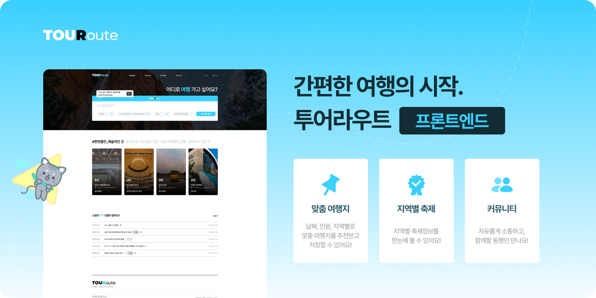
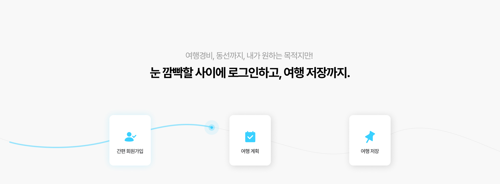
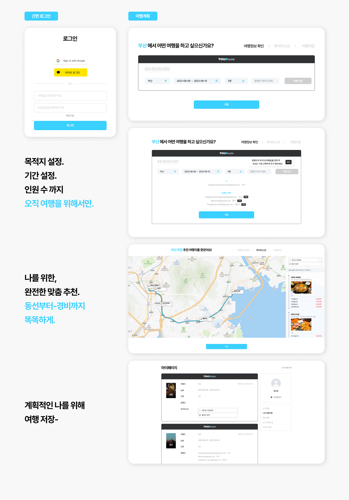
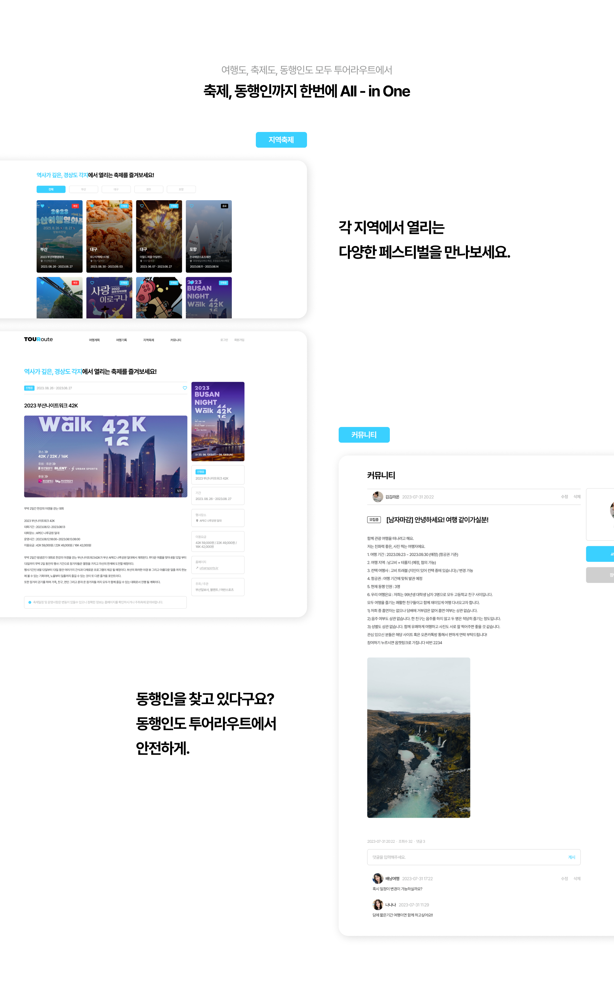
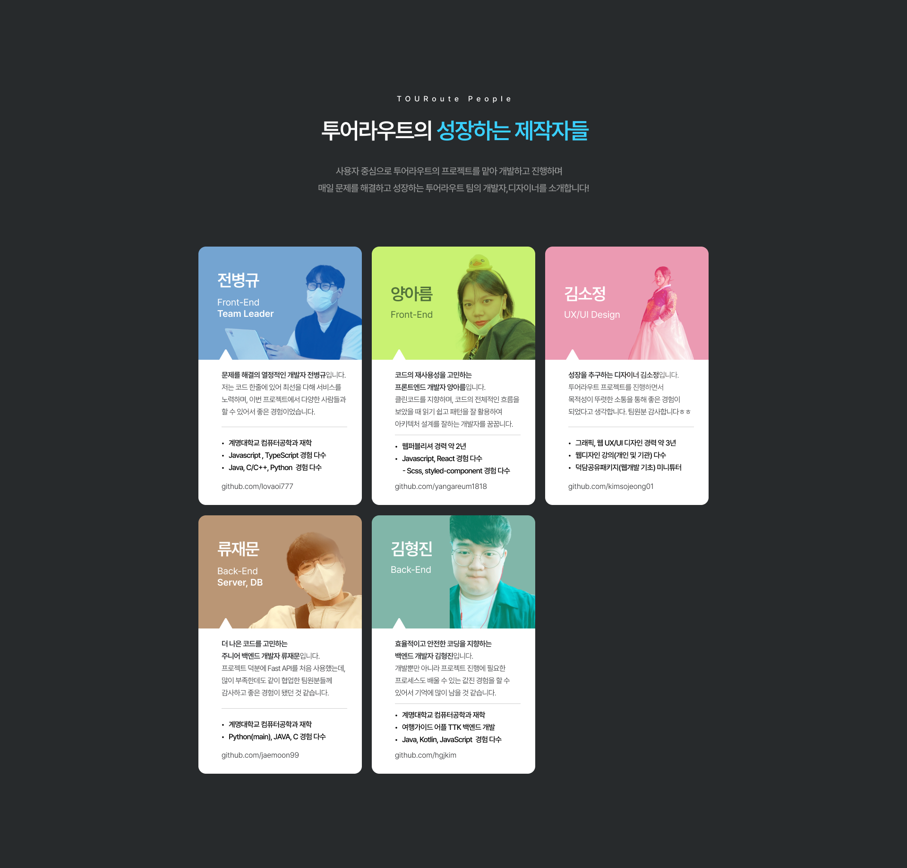

# 간편 여행의 시작, [투어라우트]

## 🪄경상도 지역의 여행지를 추천받고        커뮤니티에서 동행인도 만날 수 있는 간편한 여행의 시작

## 📢 프로젝트 소개

**개발**  
2023.08.01 ~ 2023.11.6

**배포**  
2023.11.7

**💻개발환경**  
협업 툴  

개발 환경 및 배포  

FE 사용기술  

BE 사용기술  

### ✨ 투어라우트 팀원! ✨

## 📖 프로젝트 설명

### 🤔 주제 선정을 위한 브레인스토밍
- 초안 : 우리가 할 수 있는 것이 무엇일까? -> 여행에 관심이 있다? -> 여행에 관련된 정보들을 어떻게 알 수 있을까? -> 여행 계획을 설계해주는 애플리케이션을 만들자!
- 종합 : 여행에 관심을 가지고 여행에 대한 정보들을 파악하기 위해 다양한 사이트를 통해 수집해야 하는데 처음 접하는 사람들은 수집에 한계가 있기에 이런 사람들을 위해 서비스를 제공하고자 여행 계획을 대신 작성해주는 애플리케이션을 구현하였다.
### 🤔 목적 및 필요성
- 국내 관광객을 대상으로 맞춤형 여행 계획 서비스를 제작함으로 여행객들에게 여행 일정에 관련된 편의를 도모한다.
- 여행객에게 필요한 맞춤형 여행 스타일 서비스와 최적의 동선으로 일정을 정리해 주는 간편함을 제공한다.
- 사용자로 하여금 여행에 있어서 불편함을 덜어내고 편리함을 주는 목적으로 한다. 계획 수립, 동선 파악, 여행의 스타일 등 기존에 있는 웹애플리케이션들의 문제점을 개선하여 사용자에게 도움이 되고 부담 없이 언제든 여행할 수 있다.

### ✨ 주요기능

---

1. 여행계획
    - 목적 : 국내 관광객을 대상으로 맞춤형 여행 계획 서비스를 제작함으로써 여행객들에게 여행 일정에 관련된 편의를 도모한다.
    - 특징 : 사용자로 하여금 여행에 있어서  여행 계획을 입력하여 여행 일정 동선 파악, 여행의 스타일 등 사용자에게 일정들을 소개 해준다.
2. 축제
    - 목적 : 국내 잘알려지지 않는 다양한 축제를 사용자에게 안내해준다.
    - 특징 : 경상도 개최하는 다양한 축제의 상세내용까지 안내준다.
3. 커뮤니티
    - 목적 : 자유게시판에서 궁금한 질문들을 물어보고, 동행게시판에서 여행을 같이하고 싶은 동행자를 찾는 공간을 마련했다.
    - 특징 : 게시판을 카테고리별로 구분 지어 사용자가 보기에 편리한 구조를 제공했다.
4. 동행서비스
    - 목적 : 새로운 여행 파트너를 구할 수 있도록 안내 해준다.
    - 특징 :  동행이메일을 입력하여 여행 계획일정들을 공유 해준다.

👨‍💻 **[Front-End Github](https://github.com/TourRoute/FE_TourRoute)**

🧑‍🔧 **[Back-End Github](https://github.com/TourRoute/BE_TourRoute)**

### 👥 역할분담

---

- 👨‍💻 **Front-End 전병규**
    - 여행계획 페이지 마크업 및 스타일 적용
    - 메인페이지 유효성 검사
    - 카카오맵 SDK 연결
    - 축제 페이지 마크업 및 스타일 적용
    - Vercel로 웹페이지 배포

- 👨‍💻 **Front-End 양아름**
    1. 로그인
    2. 회원가입
    3. 마이페이지
    4. 커뮤니티

- 👨‍💻 **Back-End 류재문**
    - 데이터 크롤링
        - 축제 데이터 크롤링
        - 관광지 데이터 크롤링
    - API 제작
        - 로그인 API
            - JWT토큰
        - 회원가입 API
            - Password, Email 유효성 검사
        - 마이페이지 API
            - 마이페이지 수정 (프로필 사진, 유저명)
        - 축제 API
            - 전체, 지역별 축제 조회
            - 축제 즐겨찾기
        - 게시글 API
            - 게시글 조회(전체, 카테고리), 생성, 수정, 삭제
        - 댓글 API
            - 댓글 조회, 생성, 수정, 삭제
        - 위도, 경도 기반 네비게이션 알고리즘

- 👨‍💻 **Back-End 김형진**
    - 축제 API
    - 여행계획 API
    - AWS EC2, Docker 관리

### 🏗️ 서비스 아키텍처

---

### 기능 설명
#### 로그인 및 회원가입 

### 여행계획

#### 마이페이지 

#### 축제

